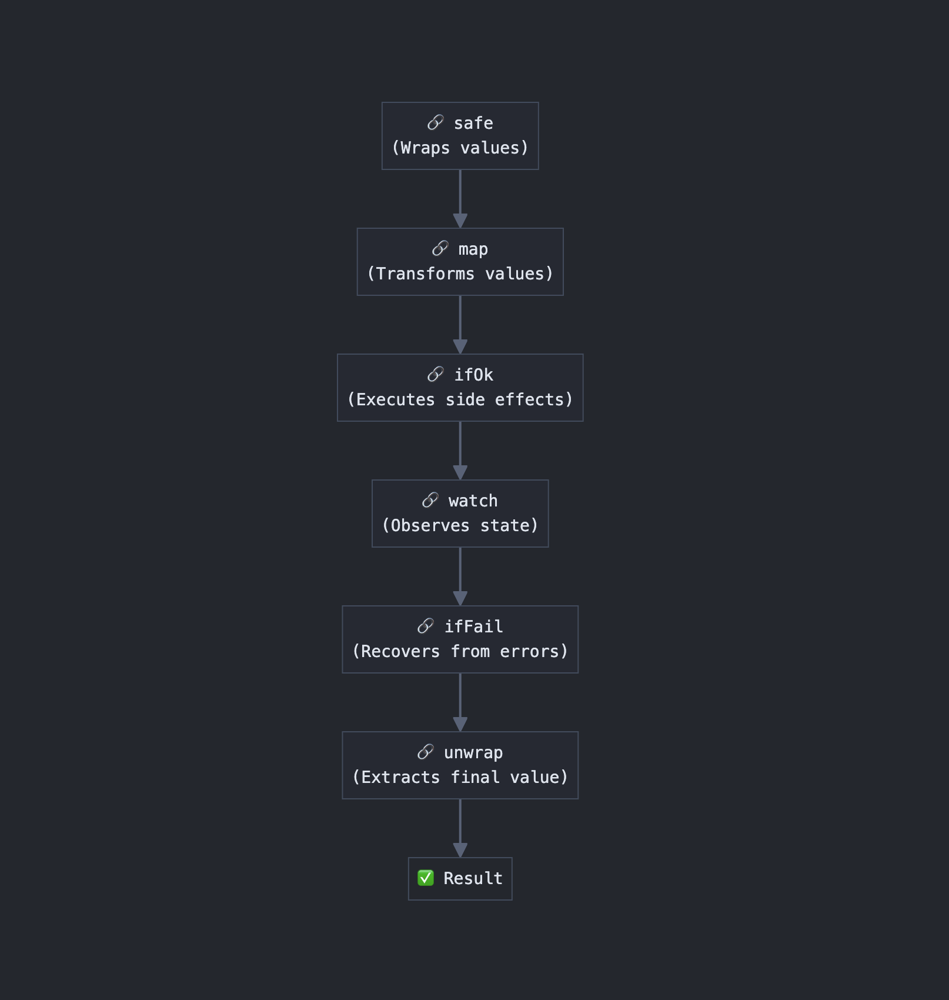

# 🔗 Safe 🔗

`Safe`는 JavaScript/TypeScript를 위한 함수형 유틸리티 라이브러리로, 오류 처리와 비동기 작업을 단순화합니다. 코드의 가독성과 유지보수성을 향상시키는 동시에 강력한 타입 안전성을 보장하는 유연한 체이닝 API를 제공합니다.

> "Safe는 `fp-ts`나 `effect.ts` 같은 대형 라이브러리의 복잡성 없이 핵심 기능을 제공합니다. 대부분의 개발자들이 큰 라이브러리의 일부 기능만 사용한다는 점을 인식하여, Safe는 직관적인 API로 필수적인 기능에만 집중합니다. 타입 안전성, 오류 처리, 비동기 작업을 위한 기본 도구만 필요합니다."



## 특징

- **안정적인 타입 안전성**: 작업이 동기적이든 비동기적이든 일관된 타입 안전성 제공
- **체이닝 API**: 더 깔끔한 코드 구조를 위한 직관적인 메서드 체이닝 지원
- **순수 함수와 부수 효과 분리**: 부수 효과가 있는 메서드와 없는 메서드를 명확히 구분
- **안전한 체이닝**: 오류가 발생해도 체인 실행을 계속할 수 있음
- **유연한 오류 처리**: `unwrap()`을 통해 오류 표면화 시점 제어 또는 `orElse()`로 대체값 제공
- **함수 구성**: Pipe 모듈을 통한 재사용 가능한 함수 파이프라인 생성

## 설치

```bash
npm install ts-safe
```

```bash
pnpm add ts-safe
```

```bash
yarn add ts-safe
```

## 기본 사용법

```typescript
import { safe } from 'ts-safe';

const result = safe(10)
  .map((x) => x * 2) // 값 변환 (10 -> 20)
  .effect(logValue) // 오류 전파가 있는 부수 효과
  .catch(handleErrors) // 필요시 오류 복구
  .watch(observeState); // 오류 전파 없는 부수 효과

console.log(result.isOk); // 체인이 성공 값을 포함하는지 확인
console.log(result.unwrap()); // 최종 값 추출 (오류가 있으면 예외 발생)
```

### 체인 시작하기

```typescript
import { safe } from 'ts-safe';

// 값으로 시작
const s1 = safe(100);

// 함수로 시작
const s2 = safe(() => {
  return 100;
});

// 값 없이 시작
const s3 = safe();

s1.unwrap() === s2.unwrap()
s3.unwarp() === undefined
```

### map: 값 변환하기

```typescript
// 체인에서 값 변환 예제
const result = safe(5)
  .map((x) => x * 2) // 5 -> 10
  .map((x) => x + 3) // 10 -> 13
  .map((x) => `값은 ${x}입니다`); // 13 -> "값은 13입니다"

console.log(result.isOk); // true
console.log(result.unwrap()); // "값은 13입니다"

// 오류가 있으면 후속 map 작업은 실행되지 않음
const errorResult = safe(1)
  .map((x) => {
    throw new Error('오류 발생');
  })
  .map((x) => x * 2); // 오류로 인해 이 변환은 건너뜀

console.log(errorResult.isOk); // false

try {
  errorResult.unwrap(); // 오류 발생
} catch (e) {
  console.error(e.message); // "오류 발생"
}

const promiseResult = safe(id)
            .map(async (id) => fetchData(id));

console.log(promiseResult.isOk); // Promise<boolean>
promiseResult.unwrap() // Promise<Data>
```

### effect: 부수 효과 적용하기

```typescript
// 동기 effect 예제 - 반환 값이 체인 값을 변경하지 않음
const syncResult = safe(42)
  .effect((value) => {
    console.log(`값 처리 중: ${value}`);
    return Boolean(value); // 이 반환 값은 체인의 값에 영향을 미치지 않음
  })
  .unwrap(); // 여전히 42 반환

// 비동기 effect 예제 - Promise 반환 시 체인이 비동기로 전환
const asyncResult = safe('data')
  .effect(async (data) => {
  // Promise가 반환되면 체인이 비동기로 전환됨
  await saveToDatabase(data);
  console.log('데이터 저장 성공');
});

await asyncResult.isOk; // Promise<true>
const result = await asyncResult.unwrap(); // "data"

// 오류 전파가 있는 effect 예제
const errorResult = safe('data')
.effect((data) => {
  throw new Error('저장 오류'); // 이 오류는 체인을 통해 전파됨
});
console.log(errorResult.isOk); // false
// errorResult.unwrap(); // '저장 오류' 예외 발생
```

### watch: 값 관찰하기

```typescript
// watch는 체인에 영향을 주지 않고 값과 오류를 관찰
const result = safe(42)
  .watch((result) => {
    const {isOk, error, value} = result as SafeResult;

    if (result.isOk) {
      console.log(`현재 값: ${result.value}`); // "현재 값: 42"
    } else {
      console.error(`오류 발생: ${result.error.message}`);
    }
    // 여기서 발생한 오류는 체인에 영향을 주지 않음
    throw new Error('이 오류는 무시됨!');
  })
  .map((x) => x * 2); // 42 -> 84

console.log(result.isOk); // true
console.log(result.unwrap()); // 84

// watch에서 Promise 반환은 체인의 동기성에 영향을 주지 않음
const syncChain = safe(10)
  .watch(async (result) => {
    if (result.isOk) {
      await someAsyncOperation();
      console.log('비동기 작업 완료');
    }
  })
  .map((x) => x + 5); // 체인은 동기 상태 유지

console.log(syncChain.unwrap()); // 15 (동기 반환)
```

### catch: 오류 복구하기

```typescript
// 오류 복구 예제
const result = safe(() => {
  throw new Error('초기 오류');
})
  .map((x) => x + 10) // 오류로 인해 실행되지 않음
  .catch((error) => {
    console.log(`오류 복구: ${error.message}`);
    return 42; // 대체 값 제공
  })
  .map((x) => x * 2); // 복구된 값(42)에 적용

console.log(result.unwrap()); // 84

// 대체값
const fallBackResult = safe(() => {
  throw new Error('비동기 복구 필요');
});

console.log(fallBackResult.isOk); // false
console.log(fallBackResult.orElse(100)); // 100 (오류 없음)
```

## API 참조

### 핵심 함수

#### `safe<T>(value: T): Safe<T>`

#### `safe<T>(fn: () => T): Safe<T>`

#### `safe(): Safe<undefined>`

값이나 함수를 Safe로 래핑합니다. 함수가 제공되면 함수를 실행하고 결과를 Safe에 저장합니다.

### 주요 메서드

#### `map<U>(transform: (value: T ) => U): Safe<T extends Promise<any> ? Promise<U> : U>`

체인의 값을 변환합니다. 값 타입을 T에서 U로 변경합니다.

#### `watch(consumer: (result: SafeResult<T) => any): Safe<T>`

체인의 현재 상태를 영향 없이 관찰합니다. 값 또는 오류를 포함하는 결과 객체를 받습니다.

#### `effect<U>(effectFn: (value: T ) => U): Safe<U extends Promise<any> ? Promise<T> : T>`

값에 부수 효과를 적용합니다. Promise를 반환하면 체인이 비동기가 됩니다. 오류가 발생하면 체인으로 전파됩니다.

#### `catch<U>(handler: (error: Error) => U): Safe<T|U>`

체인에 오류가 있을 때 대체 값을 제공합니다. Promise를 반환하면 체인이 비동기가 됩니다.

#### `isOk: Promise<boolean> | boolean`

체인이 성공 값을 포함하는지 나타내는 속성입니다. 비동기 체인의 경우 Promise를 반환합니다.

#### `unwrap(): T`

체인에서 최종 값을 추출합니다. 체인에 오류가 있으면 예외가 발생합니다.

#### `orElse<U>(fallbackValue: U): T | U`

체인에서 값을 추출하거나 오류가 있는 경우 제공된 대체 값을 반환합니다. unwrap()과 달리 이 메서드는 예외를 발생시키지 않습니다.

## 동기/비동기 처리 및 오류 전파

Safe는 다음 규칙에 따라 동기 및 비동기 작업을 지능적으로 처리합니다:

1. **부수 효과가 없는 메서드** (`watch`)
   - Promise 반환은 체인의 동기성에 영향을 주지 않음
   - 내부에서 발생하는 오류는 체인으로 전파되지 않음
   - Result 객체를 통해 값과 오류 모두에 접근 가능

2. **부수 효과가 있는 메서드** (`effect`, `catch`)
   - Promise 반환 시 체인이 비동기로 전환
   - 내부에서 발생하는 오류는 체인으로 전파됨

3. **값 변환 메서드** (`map`)
   - Promise 반환 시 체인이 비동기로 전환
   - 내부에서 발생하는 오류는 체인으로 전파됨

## 추가 모듈

Safe는 기능을 확장하는 여러 강력한 모듈을 제공합니다:

### 🛠️ util: 유용한 유틸리티

[전체 문서](./docs/util.md)

일반적인 유효성 검사, 관찰자 및 재시도 패턴:

```typescript
import { safe, errorIfNull, errorIfEmpty, watchOk, watchError, retry } from 'ts-safe';

safe(userData)
  .effect(errorIfNull('사용자 데이터가 필요합니다')) // 유효성 검사
  .map((user) => user.email)
  .effect(errorIfEmpty('이메일은 비워둘 수 없습니다'))
  .effect(retry(sendMail)) // 재시도
  .watch(watchOk(value => console.log(value))) // 값 관찰
  .watch(watchError(error => console.error(error))); // 오류 관찰
```

### 📦 pipe: 쉬운 함수 구성

[전체 문서](./docs/pipe.md)

데이터를 순차적으로 처리하는 재사용 가능한 함수 파이프라인 생성:

```typescript
import { safe } from 'ts-safe';

const processNumber = safe.pipe(
  (num: number) => num * 2,
  (num: number) => num + 10,
  (num: number) => `결과: ${num}`
);

console.log(processNumber(5).unwrap()); // "결과: 20"
```

## 라이센스

MIT